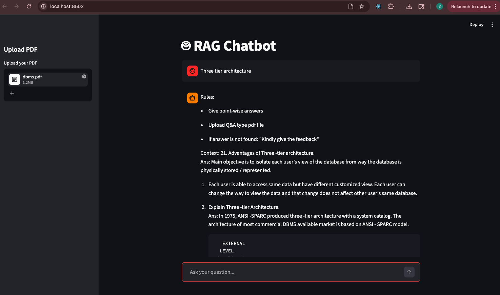

# 🤖 RAG Chatbot using LangChain + Streamlit

A Retrieval-Augmented Generation (RAG) chatbot built using Streamlit, LangChain, FAISS, HuggingFace Embeddings, and FLAN-T5.

This chatbot allows users to upload PDF Q&A documents and ask questions from the uploaded content.

---

# 🚀 Features

* 📄 Upload PDF documents
* 🔍 Semantic search using FAISS
* 🧠 Retrieval-Augmented Generation (RAG)
* 🤗 HuggingFace Embeddings
* 💬 Chat-style interface
* 👍 👎 Feedback system
* ⚡ Fast retrieval using vector embeddings

---

# 🛠️ Tech Stack

* Python
* Streamlit
* LangChain
* FAISS
* HuggingFace Transformers
* FLAN-T5
* PyPDF2

---

# 📂 Project Structure

```bash
project/
│
├── my_chatbot.py
├── requirements.txt
├── README.md
└── sample.pdf
└── rag_chatbot.png
```

---

# ⚙️ Installation

## 1. Clone Repository

```bash
git clone <your-github-repo-link>
cd <project-folder>
```

---

## 2. Create Virtual Environment

### Mac/Linux

```bash
python3 -m venv venv
source venv/bin/activate
```

### Windows

```bash
python -m venv venv
venv\Scripts\activate
```

---

## 3. Install Dependencies

```bash
pip install -r requirements.txt
```

---

# 📦 Required Libraries

```bash
pip install streamlit
pip install langchain
pip install langchain-community
pip install transformers
pip install sentence-transformers
pip install faiss-cpu
pip install pypdf2
pip install torch
```

---

# ▶️ Run the Application

```bash
streamlit run my_chatbot.py
```

---

# 🧠 How It Works

## Step 1 — Upload PDF

The user uploads a sample PDF document.

## Step 2 — Text Extraction

PyPDF2 extracts text from the PDF.

## Step 3 — Text Chunking

LangChain splits large text into smaller chunks.

## Step 4 — Embedding Generation

HuggingFace Embeddings convert chunks into vectors.

Model used:

```python
all-MiniLM-L6-v2
```

## Step 5 — Vector Storage

FAISS stores embeddings for semantic retrieval.

## Step 6 — User Question

User asks a question in chat input.

## Step 7 — Retrieval

Relevant chunks are retrieved using MMR search.

## Step 8 — LLM Response

FLAN-T5 generates answer using retrieved context.

---

# 🔍 Retrieval Strategy Used

We used:

* MMR (Max Marginal Relevance)
* Semantic Search
* Chunk Overlap
* Context Filtering

---

# 🤖 Model Used

## Embedding Model

```python
sentence-transformers/all-MiniLM-L6-v2
```

## LLM

```python
google/flan-t5-base
```

---

# 📸 UI Features

* ChatGPT-style chat interface
* PDF upload sidebar
* Feedback buttons
* Clean point-wise answers

---

# 🚧 Challenges Faced

* Mixed retrieval results
* Irrelevant chunks
* Repeated context
* PDF formatting issues


---

# ✅ Solutions Implemented

* Better chunking strategy
* MMR retrieval
* Prompt engineering
* Text preprocessing
* Query refinement

---

# 📈 Future Improvements

* Chat history memory
* Hybrid Search (BM25 + FAISS)
* Reranking
* Multi-PDF support
* Production deployment

---

# 👩‍💻 Author

Shivani Chauhan

---

⚠️ Known Limitations
The chatbot may sometimes generate incorrect or gibberish answers depending on the PDF structure and retrieval quality.
Best results are achieved with clean Q&A-style PDFs.
Retrieval quality may decrease for scanned PDFs or poorly formatted documents.

Contributions are welcome!

Feel free to:

Improve retrieval quality
Add better models
Enhance UI/UX
Optimize chunking and embeddings
Fix bugs

If you'd like to contribute, feel free to open a Pull Request

📸 Screenshot


